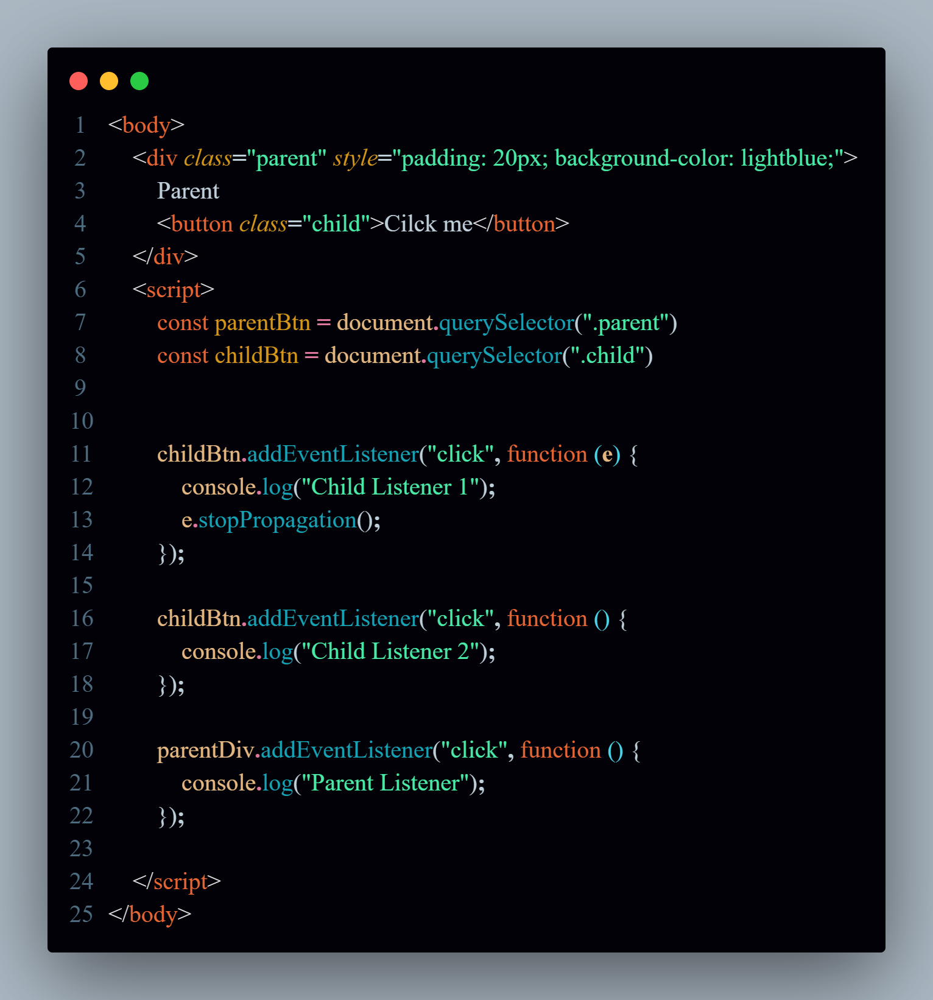
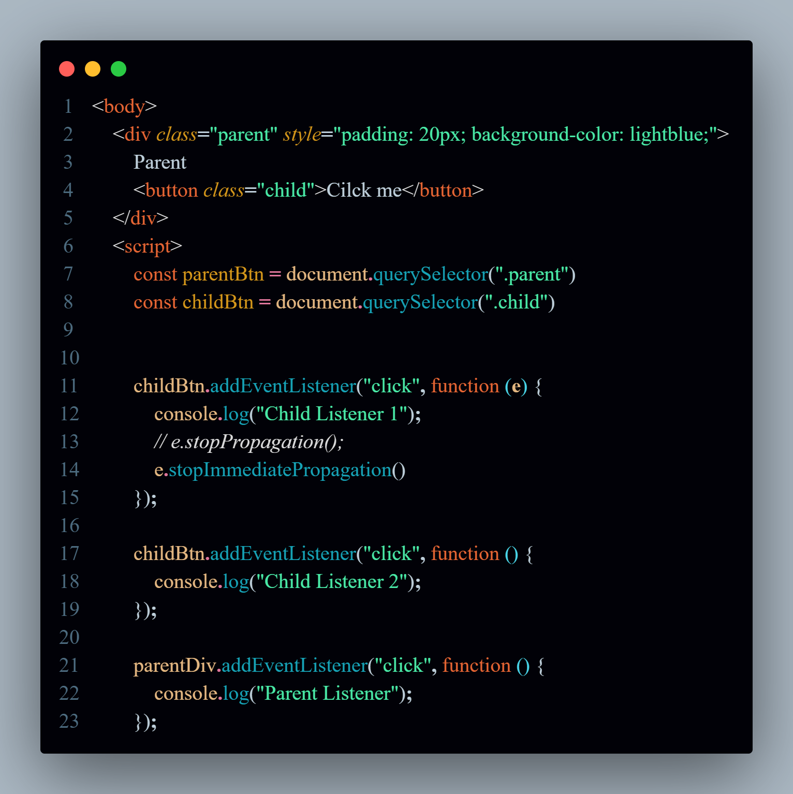

## Javascript Browser Object Model (BOM)

# what is BOM ?
- BOM is how javascript interacts with the Browser itself, not with the webpage
- BOM gives access to browser features like:
  - The browser window
  - The URL/address bar
  - Alerts, prompts, and confirms
  - Timers (setTimeout, setInterval)
  - The history (go back, forward)
  - The screen info (screen width, height)
  - The navigator (info about browser, device)

## What is PreventDefault()?
- preventDefault is used to stop the default behavior of  an event form happening.
- Default events likes: 
  - Reload the page the form is submitted.
  - Cilcking on link which navigates to new page.
  - Pressing any key which may scroll the page.

`You only use preventDefault() inside an event listener and when you want to override the browser’s default behavior.`

## Difference between stopPropagation() and stopImmediatePropagation()?

- Both stopPropagation () and stopImmediatePropagation () are used to stop Event bubbling.

- stopPropagation() used to stop the bubbling of event up to the parent element. But it doesn't stop other event listeners on the same element from running.

- stopImmeditatePropagation() its works like same as stopPropagation () but it also stop the other event listeners on the same element.

## Example:

# Image1:
- In below image we create to element one is parent and second button is child.
- Added three event listners one on parent and two on the button child.
-  Here is the `HTML` code using the stopPropagation():

- And here is the output of it:

# After using stopImmeditatePropagation():

- `HTMl` code using stopPropogation:

- And here is the Output:

----

# As you can see in the above image the difference between stopPropogation() and stopImmediatPropogation().
